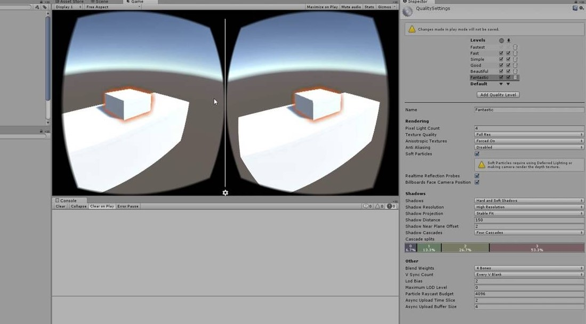

# Mixed Reality Shooter
This is a visualization project for CMPS 290A.

Mixed Reality Shooter is a small first-person shooter game developed using the Mixed Reality Toolkit. 

The main mechanic of the game involves boxes that drop from the sky at an increasing frequency over time. The player's objective is to shoot these boxes to earn points.

